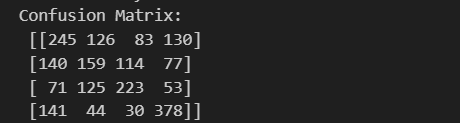

# Developing a Neural Network Classification Model

## AIM

To develop a neural network classification model for the given dataset.

## Problem Statement

An automobile company has plans to enter new markets with their existing products. After intensive market research, they’ve decided that the behavior of the new market is similar to their existing market.

In their existing market, the sales team has classified all customers into 4 segments (A, B, C, D ). Then, they performed segmented outreach and communication for a different segment of customers. This strategy has work exceptionally well for them. They plan to use the same strategy for the new markets.

You are required to help the manager to predict the right group of the new customers.

## Neural Network Model


## DESIGN STEPS

### STEP 1:
Understand the classification task and identify input and output variables.

### STEP 2:
Gather data, clean it, handle missing values, and split it into training and test sets.
### STEP 3:
Normalize/standardize features, encode categorical labels, and reshape data if needed.
### STEP 4:
Choose the number of layers, neurons, and activation functions for your neural network.

### STEP 5:
Select a loss function (e.g., binary cross-entropy), optimizer (e.g., Adam), and metrics (e.g., accuracy).


### STEP 6:
Feed training data into the model, run multiple epochs, and monitor the loss and accuracy.

### STEP 7:
Save the trained model, export it if needed, and deploy it for real-world use.


## PROGRAM

### Name: Guru Raghav Ponjeevith V
### Register Number:212223220027.

```python
class PeopleClassifier(nn.Module):
    def __init__(self, input_size):
        super(PeopleClassifier, self).__init__()
        self.fc1=nn.Linear(input_size,32)
        self.fc2=nn.Linear(32,16)
        self.fc3=nn.Linear(16,8)
        self.fc4=nn.Linear(8,4)
    def forward(self,x):
        x=F.relu(self.fc1(x))
        x=F.relu(self.fc2(x))
        x=F.relu(self.fc3(x))
        x=self.fc4(x)
        return x
        

```
```python
# Initialize model
model =PeopleClassifier(input_size=X_train.shape[1])
criterion =nn.CrossEntropyLoss()
optimizer =optim.Adam(model.parameters(),lr=0.001)


```
```python
# Training Loop
def train_model(model, train_loader, criterion, optimizer, epochs):
  for epoch in range(epochs):
    model.train()
    for X_batch,y_batch in train_loader:
      optimizer.zero_grad()
      outputs=model(inputs)
      loss=criterion(outputs,labes)
      loss.backward()
      optimizer.step()


    if (epoch + 1) % 10 == 0:
        print(f'Epoch [{epoch+1}/{epochs}], Loss: {loss.item():.4f}')
```


## Dataset Information


## OUTPUT
## Test Accuracy


### Confusion Matrix




### Classification Report


### New Sample Data Prediction

## RESULT
Thus a neural network classification model for the given dataset is executed successfully.
